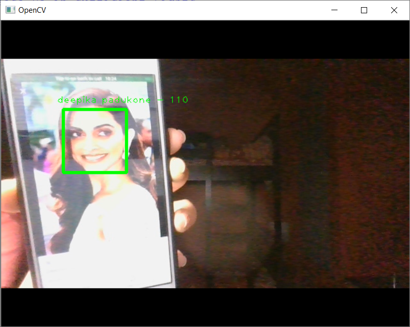

# Face-Recognition
Face recognition in python using openCV

This project detects the images of the Indian actress deepika padukone. 
To use the project, run the create_data python file first in order to create datasets.
for every time you create a new data, change the dataset name in python code in face_recognize python file in order to store 
the datasets images in their respective named folders.

